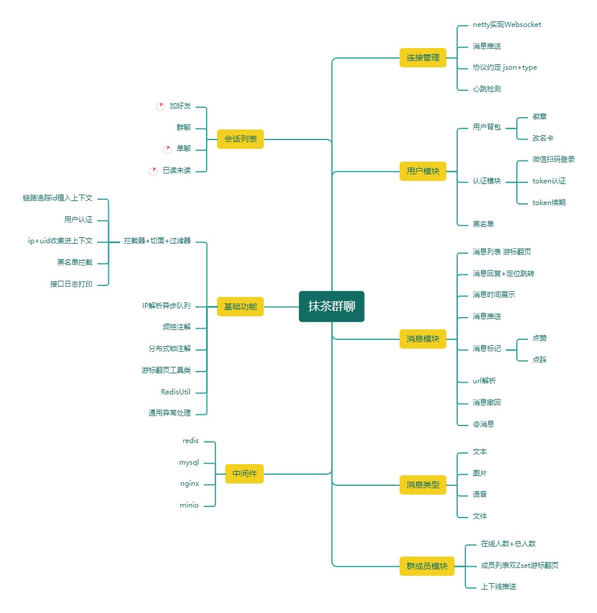
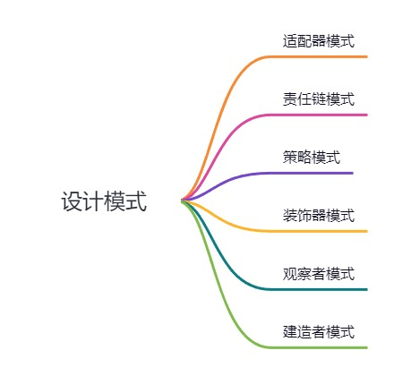
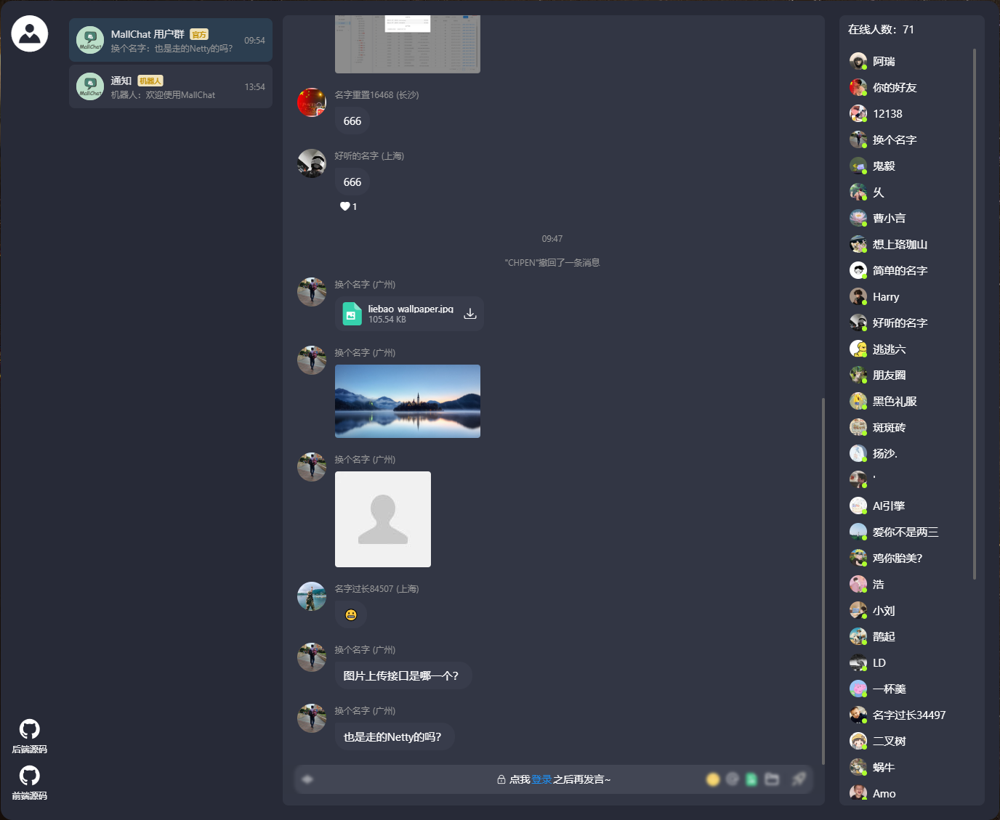

    

<h1 align="center">MallChat-抹茶</h1>

<strong>一个既能购物又能即时聊天的电商系统。致力于打造互联网企业级项目的最佳实践。 电商该有的购物车、订单、支付、推荐、搜索、拉新、促活、推送、物流、客服、它都必须有。<em>持续更新 ing～</em></strong>

## 项目导航

- **快速体验地址**：[抹茶聊天首页](http://81.69.3.48:9988/)

## 项目介绍

抹茶聊天是一个IM项目，通过netty实现和前端的websocket连接。内含微信扫描登录，成员列表，消息列表，消息互动，丰富的消息类型，还有很多实用的小轮子列如aop日志，分布式锁注解，频控注解，ip解析归属地等，持续更新中。。。

### 项目演示

#### C端项目

- 项目演示地址：[http://81.69.3.48:9988/](http://81.69.3.48:9988/)

### 技术选型

#### 后端技术

|        技术         | 说明                                       | 官网                                                         |
| :-----------------: | ------------------------------------------ | ------------------------------------------------------------ |
|     SpringBoot      | web开发必备框架                            | [https://spring.io/projects/spring-boot](https://spring.io/projects/spring-boot) |
|       MyBatis       | ORM框架                                    | http://www.mybatis.org/mybatis-3/zh/index.html               |
|     MyBatisPlus     | 零sql，简化数据库操作，分页插件            | [https://baomidou.com/](https://baomidou.com/)               |
|        Redis        | 缓存加速，多数据结构支持业务功能           | [https://redis.io](https://redis.io)                         |
|      Caffeine       | 本地缓存                                   | http://caffe.berkeleyvision.org/                             |
|        Nginx        | 负载均衡，https配置，websocket升级，ip频控 | [https://nginx.org](https://nginx.org)                       |
|       Docker        | 应用容器引擎                               | [https://www.docker.com](https://www.docker.com)             |
|         Oss         | 对象存储                                   | [https://letsencrypt.org/](https://letsencrypt.org/)         |
|         Jwt         | 用户登录，认证方案                         | [https://jwt.io](https://jwt.io)                             |
|       Lombok        | 简化代码                                   | [https://projectlombok.org](https://projectlombok.org)       |
|       Hutool        | Java工具类库                               | https://github.com/looly/hutool                              |
|     Swagger-UI      | API文档生成工具                            | https://github.com/swagger-api/swagger-ui                    |
| Hibernate-validator | 接口校验框架                               | [hibernate.org/validator/](hibernate.org/validator/)         |
|        minio        | 自建对象存储                               | https://github.com/minio/minio                               |

### 环境搭建

在项目目录下的`application.yml`修改自己的启动环境`spring.profiles.active` = `test`然后找到同级文件`application-test.properties`，填写自己的环境配置。
